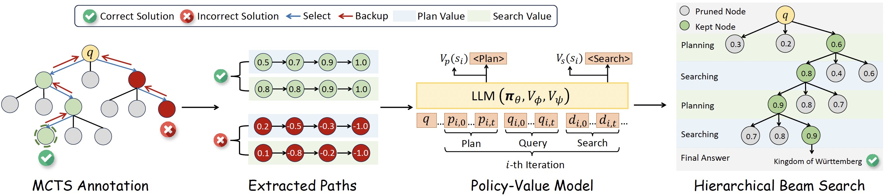
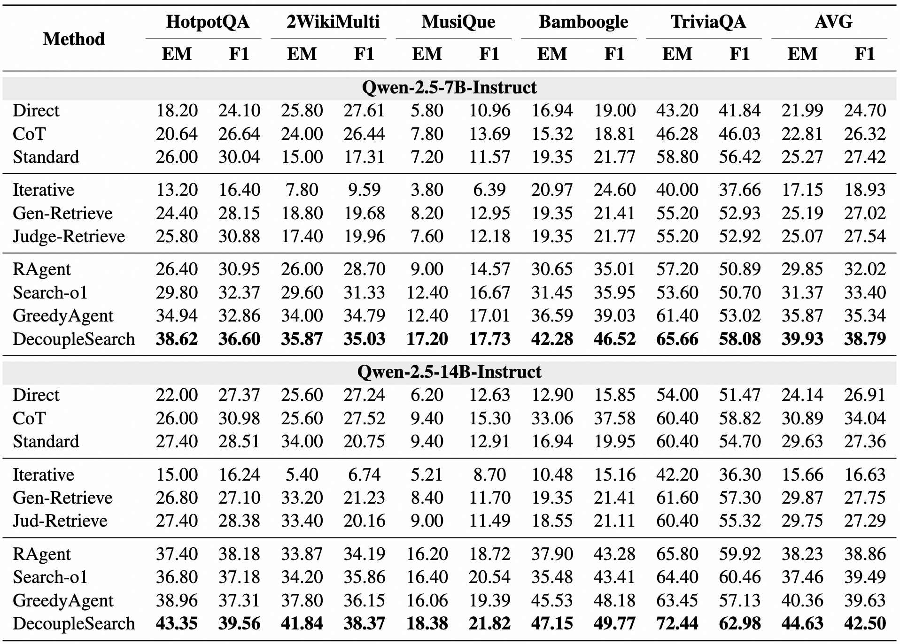
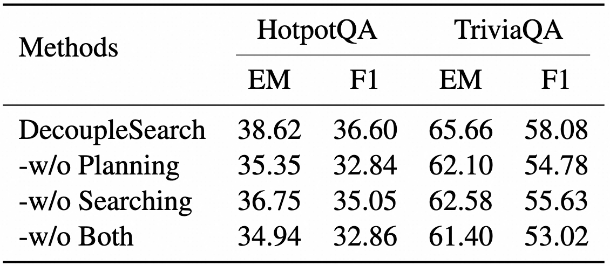
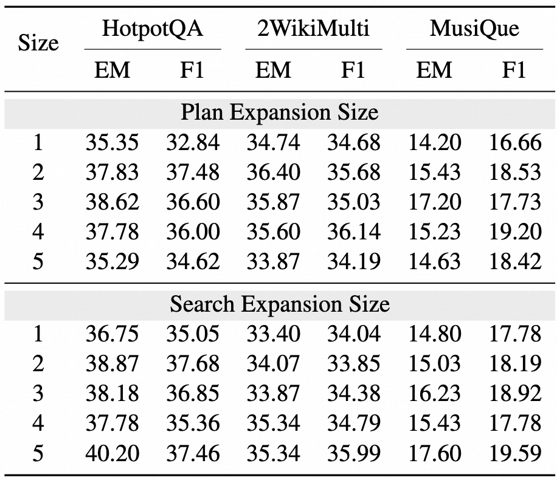
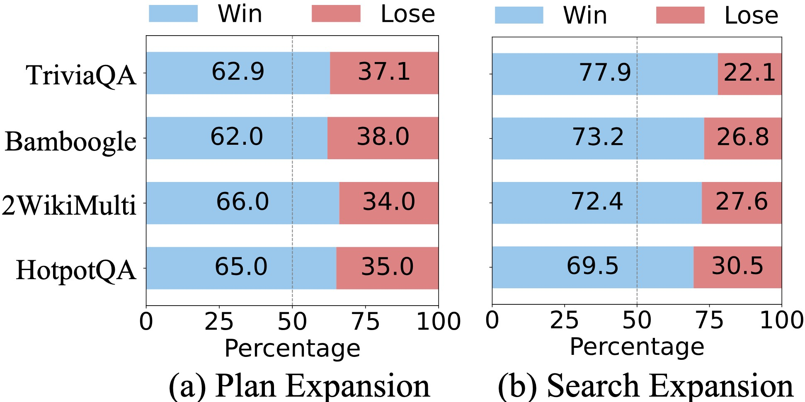
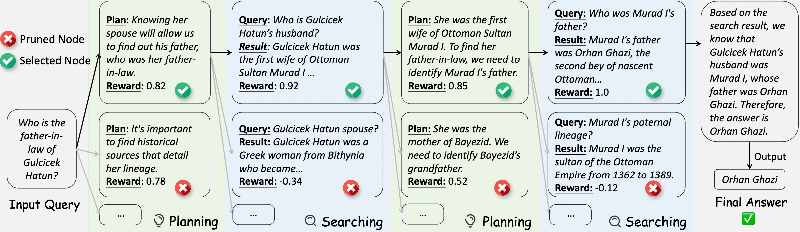

<div align="center">
<p align="center">
  
</p>
</div>
<div align="center">
<h1>DecoupleSearch: Decouple Planning and Search via Hierarchical Reward Modeling
</h1>
</div>

<div align="center">
  <a href='https://sunhaonlp.github.io/DecoupleSearch/'></a>
  <a href='https://github.com/sunhaonlp/DecoupleSearch/blob/main/paper/DecoupleSearch.pdf'></a>
  <a href='https://huggingface.co/collections/sunhaonlp/decouplesearch-6860d78abbe29b43f6c347d4'></a>
  <a href='https://huggingface.co/datasets/sunhaonlp/DecoupleSearch_dataset'></a>
</div>
<p align="center">
  <i><b>Hao Sun, Zile Qiao, Bo Wang, Guoxin Chen, Yingyan Hou,</b></i><br>
  <i><b>Yong Jiang, Pengjun Xie, Fei Huang, Yan Zhang</b></i><br>
  <i>Tongyi Lab , Alibaba Group</i>
</p>


# 📌 Introduction

- We introduce DecoupleSearch, a novel Agentic RAG framework that decouples planning-searching processes with dual value models, enabling independent optimization of plan reasoning and search grounding.
- We propose improving the success rate of each step by fully exploring the planning and searching spaces. We utilize MCTS to accurately assess planning and searching quality, while Hierarchical Beam Search is employed to prune the exponential candidate space efficiently.
- Extensive experiments on five datasets across policy models of different parameter sizes demonstrate the effectiveness of our method.

# 🛠 Dependencies

```bash
conda create -n DS_infer python=3.9
conda activate DS_infer
pip install -r requirements_DS_infer.txt

conda create -n DS_train python=3.10
conda activate DS_train
pip install -r requirements_DS_train.txt

## WANDB Configuration
export WANDB_KEY=YOUR_WANDB_KEY_HERE
```


# 📖 Quick Start
(1) Prepare for the retriever.

```bash
# Download the retrieval indexing corpus.
wget https://rgw.cs.uwaterloo.ca/pyserini/indexes/lucene-index.wikipedia-dpr-100w.20210120.d1b9e6.tar.gz
wget https://rgw.cs.uwaterloo.ca/pyserini/indexes/faiss.wikipedia-dpr-100w.dpr_multi.20200127.f403c3.tar.gz

mkdir retriever
tar -zxvf lucene-index.wikipedia-dpr-100w.20210120.d1b9e6.tar.gz && mv lucene-index.wikipedia-dpr-100w.20210120.d1b9e6 retriever
tar -zxvf faiss.wikipedia-dpr-100w.dpr_multi.20200127.f403c3.tar.gz && mv faiss.wikipedia-dpr-100w.dpr_multi.20200127.f403c3 retriever

## Retriever Server
conda activate DS_infer
python retriever_server.py --port 5000
```

(2) Conduct the MCTS labeling.

```bash
## Download the MCTS labeled data
huggingface-cli download --repo-type dataset --resume-download sunhaonlp/DecoupleSearch_dataset --local-dir data

## Activate the environment
conda activate DS_infer

## (Optional) If you want to conduct the MCTS labeling by yourself, you can follow these steps:
## LLM server
python -m sglang.launch_server --model-path Qwen2.5-72B-Instruct --host 0.0.0.0 --tp 4 --dp 1 --port 6000

## MCTS labeling
bash mcts_labeling.sh DATA_FILE mcts_labeling_data TOTAL_PARTS 4 LLM Qwen2.5-72B-Instruct MAX_EXPANSION_NUM 5 ITERATIONS 40 THRESHOLD 50 TEMPERATURE 1 RETRIEVER_IP localhost RETRIEVER_PORT 5000 LOCAL_LLM_IP localhost LOCAL_LLM_PORT 6000

## Process the label data
python train_data_process.py --label_directory THE_RESULT_DIRECTORY
```

(3) Conduct the policy-value model training.

```bash
conda activate DS_train
bash train.sh DATASET train_data EPOCH 10 LR 5e-6 PER_DEV_BATCH_SIZE 4 MODEL_PATH Qwen2.5-7B-Instruct NUM_NODES 8 TRAIN_ON_PROMPT False SAVE_STEP 350 WEIGHT_ALPHA 0.1 PORT 35000 
```

(4) Conduct the hierarchical beam search.

```bash
## Activate the environment
conda activate DS_infer

## Policy Model
python -m sglang.launch_server --model-path PATH_TO_MODEL --host 0.0.0.0 --tp 2 --dp 1 --port 7000

## Value Model
python value_model_server.py --port 7001 --base_device 0 --model_path PATH_TO_MODEL

## Start the inference
bash inference.sh DATASET nq MODEL_PATH PATH_TO_MODEL BEAM_DEPTH 10 EXPAND_NUM_THOUGHT 3 BEAM_SIZE_THOUGHT 1 EXPAND_NUM_SEARCH 3 BEAM_SIZE_SEARCH 1 TEMPERATURE 0.7 POLICY_IP localhost POLICY_PORT 7000 VALUE_IP localhost VALUE_PORT 7001 RETRIEVER_IP localhost RETRIEVER_PORT 5000 
```

# 💡 Performance

### 📊 Main Results

<div align="center">
    
</div>

### 📊 Ablation Study 

<div align="center">
    
</div>

### 📊 Scaling with Planning and Searching

<div align="center">
    
</div>

### 📊 Effectiveness of Value Models

<div align="center">
    
</div>

### 📊 Case Study

<div align="center">
    
</div>


# 🙏 Acknowledgements

This work is implemented based on [AlphaMath](https://github.com/MARIO-Math-Reasoning/Super_MARIO) and [LLaMA-Factory](https://github.com/hiyouga/LLaMA-Factory). We sincerely thank the authors of these projects for their valuable contributions to the open-source community.
